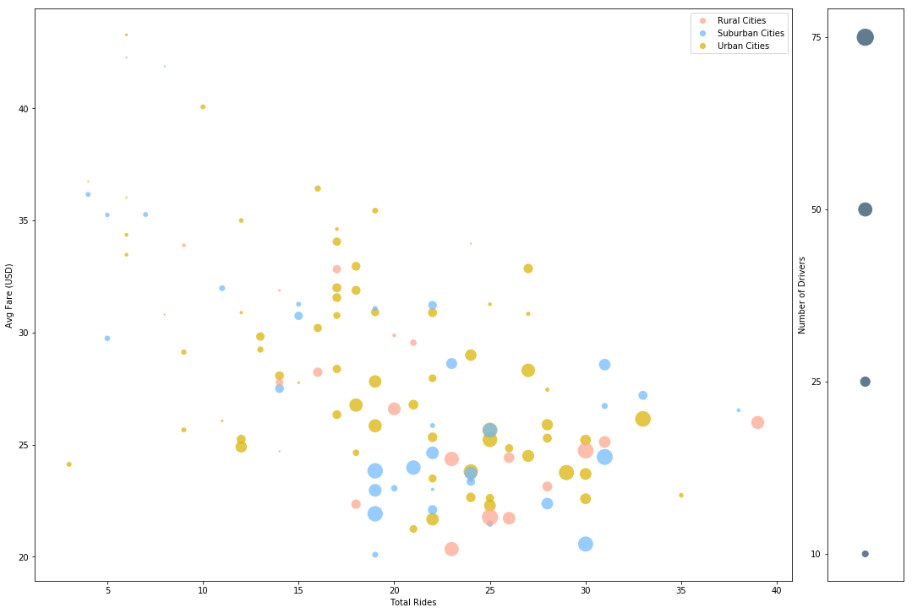
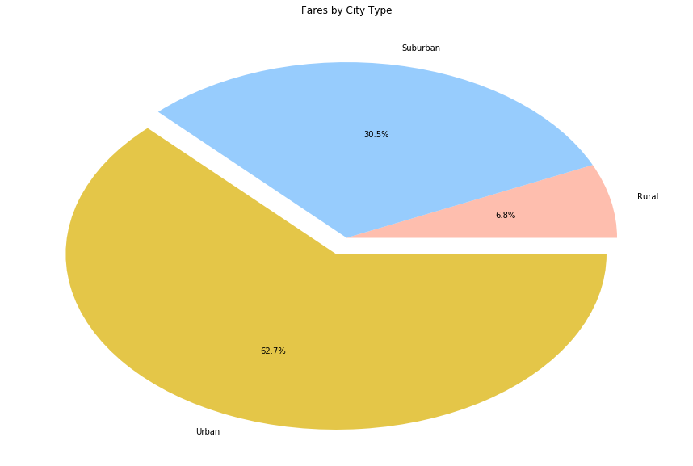
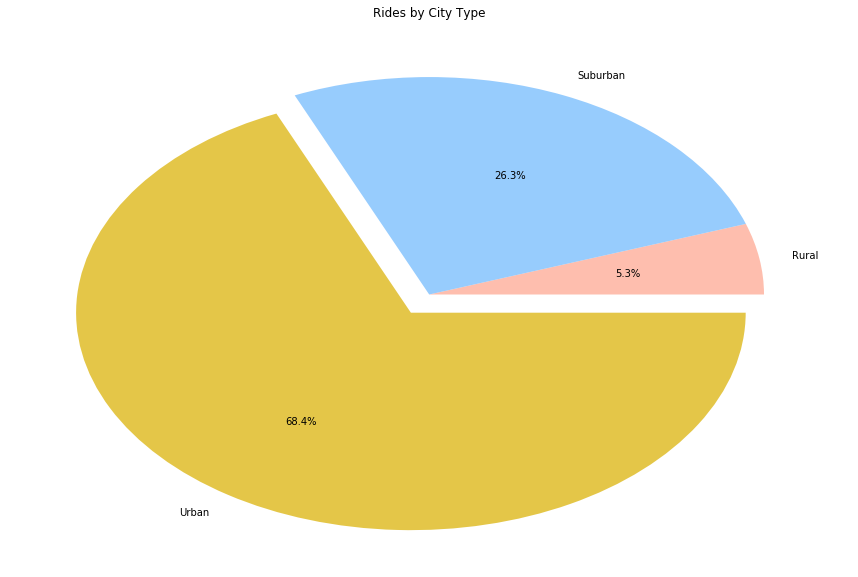
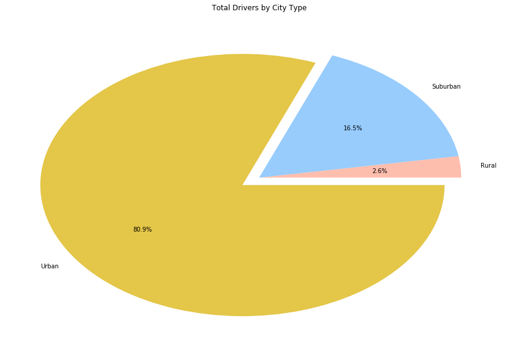

### Pyber Data Analysis
* Trend 0: The vast majority of Pyber users are in Urban cities.
* Trend 1: While Urban cities do have the majority of Fare, Rides, and Drivers, their majority is larger in Rides than Fares, and larger in Drivers than Rides.
* Trend 2: Across all city types there is a general inverse correlation between average fare and number of rides. (This matches a broad supply/demand model for rides.)
* Trend 3: If you examine the relationship between total drivers and total fares, it is clear that although Urban cities contain the majority of fares and rides, rural cities have the highest average fare/driver and are thus the most profitable for an individual driver.

## Conclusions
* 1. Rural cities are the most profitable market for a new Pyber driver to target. 
* 2. Urban cities are the most profitable market for Pyber as a company to target.
-----

```python
# import libraries
%matplotlib inline
import matplotlib.pyplot as plt
import pandas as pd
import numpy as np
import seaborn as sns
```


```python
# read data in to dataframes
ride_data = pd.read_csv("raw_data/ride_data.csv")
city_data = pd.read_csv("raw_data/city_data.csv")
```


```python
print(ride_data.sample(10))
print(city_data.sort_values('driver_count', ascending=True))
```

                     city                 date   fare        ride_id
    559   Christopherfurt  2018-02-08 11:46:15  25.76   951780836764
    1700        Grayville  2018-04-06 03:38:40  18.11  6203774514474
    946        West Heidi  2018-04-18 20:05:50  32.74  1746486459381
    1277   North Markport  2018-04-06 02:16:42  18.15  7268609489111
    1630   East Marymouth  2018-03-29 08:36:20  37.60  6370863861570
    1329    Lake Scottton  2018-03-29 13:33:11  35.36  3706314280455
    1414  South Karenland  2018-02-26 20:40:36  35.61  8413974071006
    18       West Anthony  2018-03-06 02:27:01  10.02  9396763280782
    888   Christopherfurt  2018-05-03 12:46:04  14.43  5644928631417
    746        Port David  2018-03-27 00:20:58  18.43  4635592843405
                       city  driver_count      type
    89         South Brenda             1  Suburban
    100  North Richardhaven             1  Suburban
    107         Taylorhaven             1     Rural
    118         Jessicaport             1     Rural
    112         North Jaime             1     Rural
    104          Newtonview             1     Rural
    113   South Marychester             1     Rural
    73            Grayville             2  Suburban
    78      Williamsonville             2  Suburban
    111     Lake Latoyabury             2     Rural
    116        New Ryantown             2     Rural
    67             Lake Ann             3  Suburban
    58        Port Johnbury             3     Urban
    80        West Kimmouth             4  Suburban
    41      South Karenland             4     Urban
    95            Lewisland             4  Suburban
    109      Harringtonfort             4     Rural
    110          Lake Jamie             4     Rural
    103        West Heather             4     Rural
    74      Lake Robertside             4  Suburban
    93       East Marymouth             5  Suburban
    55   Lake Jonathanshire             5     Urban
    40            Karenside             5     Urban
    108         Penaborough             6     Rural
    106         Michaelberg             6     Rural
    53          North Jason             6     Urban
    82        North Timothy             7  Suburban
    99       East Aaronbury             7  Suburban
    66           Port Shane             7  Suburban
    102      South Jennifer             7     Rural
    ..                  ...           ...       ...
    4           West Robert            39     Urban
    11         Joneschester            39     Urban
    35           Justinberg            39     Urban
    50      Christopherfurt            41     Urban
    56          New Paulton            44     Urban
    60        New Paulville            44     Urban
    51         Valentineton            45     Urban
    47      West Josephberg            45     Urban
    62         Williamsview            46     Urban
    29           South Jack            46     Urban
    65          Roberthaven            47     Urban
    6           West Angela            48     Urban
    54            Deanville            49     Urban
    63       New Jacobville            50     Urban
    18          Carriemouth            52     Urban
    42         West Gabriel            57     Urban
    64   Port Samanthamouth            57     Urban
    46        Lake Scottton            58     Urban
    48            Pattyland            59     Urban
    1          Williamsstad            59     Urban
    26          Grahamburgh            61     Urban
    20             Jerryton            64     Urban
    32              Royland            64     Urban
    38      East Kaylahaven            65     Urban
    15         Reynoldsfurt            67     Urban
    2           Port Angela            67     Urban
    30             Liumouth            69     Urban
    5          West Anthony            70     Urban
    49   South Michelleport            72     Urban
    25     West Samuelburgh            73     Urban
    
    [120 rows x 3 columns]


```python
# function to map city to city type
def citytype(cityname):
    city_type = city_data[city_data['city'] == cityname]['type'].values[0]
    return city_type
```


```python
# adding city type to rider_data
ride_data['type'] = ride_data['city'].apply(citytype)
```


```python
# Data arrays (index/column(s))
# city/avg fare
city_fare = ride_data.groupby('city')['fare'].mean()

# city type/total fare
type_fare = ride_data.groupby('type')['fare'].sum()

# city/total rides given
city_ride = ride_data.groupby('city')['ride_id'].nunique()

# city type/total rides 
type_ride = ride_data.groupby('type')['ride_id'].nunique()

# index/city/total drivers
city_drivers = city_data[['city','driver_count']].sort_values('city',ascending=True)

# city type/total drivers
type_drivers = city_data.groupby('type')['driver_count'].sum()

# index/city/city type
city_type = city_data[['city','type']].sort_values('city',ascending=True)

# city type/total fare
type_fare = ride_data.groupby('type')['fare'].sum()

```


```python
# function to map city type to a color
def citycolor(citytype):
    if citytype == 'Urban':
        color = sns.xkcd_rgb["gold"]
    elif citytype == 'Suburban':
        color = sns.xkcd_rgb["sky blue"]
    elif citytype == 'Rural':
        color = sns.xkcd_rgb["light salmon"]
    else:
        color = 'grey'
    return color
```


```python
# bubble size = total drivers
bubble_size = city_drivers['driver_count'].values

# color = city type
color = city_data['type'].apply(citycolor)
```


```python
plt.rcParams['figure.figsize'] = [15, 10]
```


```python
# Sub Plot setup
fig, (ax1, ax2) = plt.subplots(1,2, gridspec_kw = {'width_ratios':[10, 1]})
fig.suptitle('', fontsize=16, fontweight="bold")
fig.tight_layout()

# legend setup
urban_handle, = ax1.plot([],[], marker='o', linestyle='None', color=sns.xkcd_rgb["gold"], 
                         label='Urban Cities', alpha=0.75)
sub_handle, = ax1.plot([],[], marker='o', linestyle='None', color=sns.xkcd_rgb["sky blue"], 
                       label='Suburban Cities', alpha=0.75)
rural_handle, = ax1.plot([],[], marker='o', linestyle='None', color=sns.xkcd_rgb["light salmon"], 
                         label='Rural Cities', alpha=0.75)
example_bubbles = [50,125,250,375]

# first subplot
ax1.scatter(city_ride.values,city_fare.values, marker='o', facecolors=color, edgecolor=sns.xkcd_rgb["black"], 
            linewidth=0, s=(bubble_size * 5), alpha=0.75)
ax1.set_xlabel('Average Fare, Total Rides, and Total Drivers by City')
ax1.legend(handles=[rural_handle, sub_handle, urban_handle], loc='best')
ax1.set_xlabel('Total Rides')
ax1.set_ylabel('Avg Fare (USD)')

# second subplot
ax2.scatter([1,1,1,1], [1,2,3,4], marker="o", s=(example_bubbles), facecolors=sns.xkcd_rgb["blue grey"])
ax2.set_xticks([])
ax2.set_xticklabels([''])
ax2.set_yticks([1,2,3,4])
ax2.set_yticklabels([10,25,50,75])
ax2.set_ylabel('Number of Drivers')

plt.show()
```





```python
# setting pie chart colors
colors = [sns.xkcd_rgb["light salmon"], sns.xkcd_rgb["sky blue"], sns.xkcd_rgb["gold"]]
# setting pie chart explode
explode = [0,0,.1]
# setting pie chart plot
farepie = plt.pie(type_fare.values, labels=type_fare.index, colors=colors, explode=explode, autopct='%1.1f%%', startangle=0)

# messing with color transparency
farepie[0][0].set_alpha(0.75)
farepie[0][1].set_alpha(0.75)
farepie[0][2].set_alpha(0.75)

plt.title('Fares by City Type')
plt.show()


```





```python
# setting pie chart plot
ridepie = plt.pie(type_ride.values, labels=type_ride.index, colors=colors, explode=explode, autopct='%1.1f%%', startangle=0)

# messing with color transparency
ridepie[0][0].set_alpha(0.75)
ridepie[0][1].set_alpha(0.75)
ridepie[0][2].set_alpha(0.75)

plt.title('Rides by City Type')
plt.show()

```





```python
# setting pie chart plot
driverpie = plt.pie(type_drivers.values, labels=type_drivers.index, colors=colors, explode=explode, autopct='%1.1f%%', startangle=0)

# messing with color transparency
driverpie[0][0].set_alpha(0.75)
driverpie[0][1].set_alpha(0.75)
driverpie[0][2].set_alpha(0.75)

plt.title('Total Drivers by City Type')
plt.show()

```




